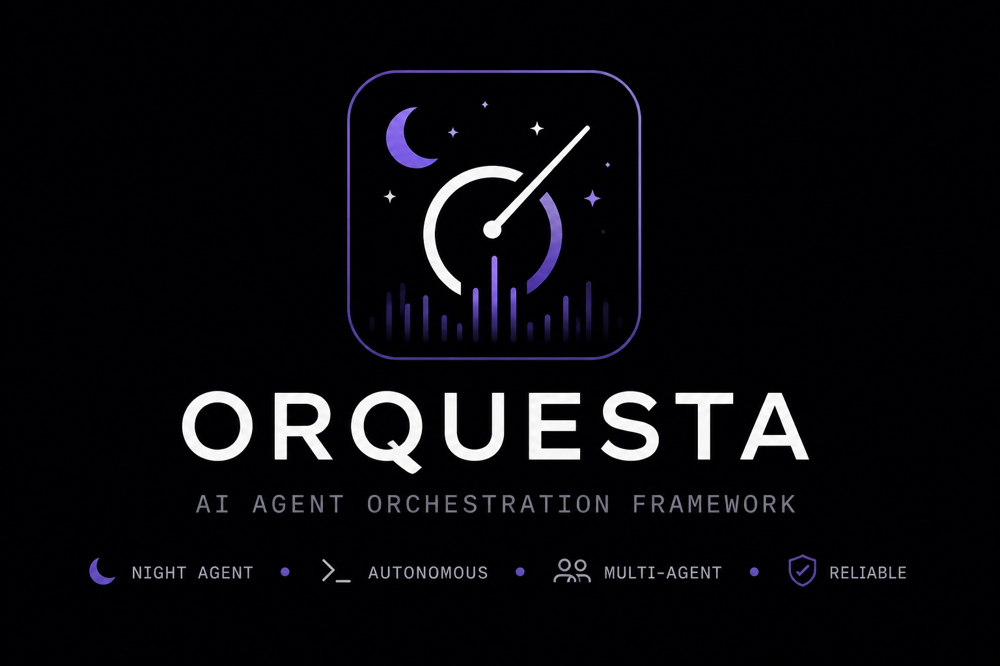

# orquestalite

Minimalist Go orchestrator for the Ralph technique: a single binary that drives
multiple CLI-based AI agents through parser, coder, tester, critic, and reviewer
roles until a plan is implemented task by task.

The Go module is `github.com/lionelchamorro/orquestalite`. The CLI command is
`orq-lite`, and runtime state lives under `.orquestalite/`.

## Bootstrap a repo

Run this from the root of the repo you want to set up.

**Existing working repo (recommended): let an agent do it.** The bootstrap needs
judgment the CLI can't automate — new-vs-existing detection, getting the
baseline test/lint gates green at HEAD, toolchain/lockfile pinning, choosing
which flow fits the repo, and additive `team.json` / `conventions` merges. The
CLI does the deterministic clean-adds (`orq-lite init`); the agent drives it and
handles the judgment calls. Point your agent at the guide:

> Set up this repo by following the instructions here:
> https://raw.githubusercontent.com/lionelchamorro/orquesta-lite/main/guide.md
> Don't summarize it — follow every step.

The guide covers installing `orq-lite` if it isn't already on PATH, scaffolding
config, making the gates green, and picking + wiring the right flow (from a
quick per-feature batch to the governed [`examples/governed-pack/`](./examples/governed-pack/)).

**Just want the binary?** See [Install](#install) below, then `orq-lite init`.

## What It Does

`orquestalite` turns a free-form plan into structured tasks, runs those tasks
through nested review/fix loops, and uses JSON result files written by each agent
to decide what happens next.

The orchestrator itself does not edit files or run model tool calls. It invokes
configured CLI agents as subprocesses, reads their result contracts, tracks
task state in `.orquestalite/tasks.json`, and commits successful tasks.

## Install

### From a GitHub release (recommended)

Pre-built binaries are published for Linux, macOS, and Windows on `amd64` and
`arm64`. Pick the archive matching your platform from the
[releases page](https://github.com/lionelchamorro/orquesta-lite/releases) and
extract `orq-lite` onto your `PATH`.

**macOS / Linux** — replace `VERSION`, `OS` (`darwin` or `linux`), and `ARCH`
(`amd64` or `arm64`):

```bash
VERSION=v0.1.0
OS=darwin
ARCH=arm64
curl -L -o orq-lite.tar.gz \
  "https://github.com/lionelchamorro/orquesta-lite/releases/download/${VERSION}/orq-lite-${VERSION}-${OS}-${ARCH}.tar.gz"

# Optional: verify checksum
curl -L -o orq-lite.tar.gz.sha256 \
  "https://github.com/lionelchamorro/orquesta-lite/releases/download/${VERSION}/orq-lite-${VERSION}-${OS}-${ARCH}.tar.gz.sha256"
shasum -a 256 -c orq-lite.tar.gz.sha256

tar -xzf orq-lite.tar.gz
sudo mv "orq-lite-${VERSION}-${OS}-${ARCH}/orq-lite" /usr/local/bin/
orq-lite --help
```

On macOS, Gatekeeper may block the unsigned binary on first run. Allow it with:

```bash
xattr -d com.apple.quarantine /usr/local/bin/orq-lite
```

**Windows (PowerShell)**:

```powershell
$Version = "v0.1.0"
$Arch    = "amd64"   # or "arm64"
$Url     = "https://github.com/lionelchamorro/orquesta-lite/releases/download/$Version/orq-lite-$Version-windows-$Arch.zip"
Invoke-WebRequest -Uri $Url -OutFile orq-lite.zip
Expand-Archive orq-lite.zip -DestinationPath .
# Move orq-lite.exe somewhere on your PATH
```

### From source

```bash
go build -o orq-lite ./cmd/orq-lite
```

## Quick Start

Scaffold project state, prompts, and `team.json`:

```bash
./orq-lite init
```

Create a plan file:

```bash
cat > plan.md <<'EOF'
Add a small feature, update tests, and keep the implementation minimal.
EOF
```

Convert the plan into tasks:

```bash
./orq-lite plan plan.md
```

Run the orchestration loop:

```bash
./orq-lite run
```

Check progress:

```bash
./orq-lite status
./orq-lite status --watch
```

Reset local orchestration state:

```bash
./orq-lite reset
```

Run a whole backlog of features, each on its own branch (factory mode):

```bash
cat > plan.md <<'EOF'
# PRM capacity planning

Add per-person FTE capacity, prospective-project dates, and a capacity
roll-up endpoint with an over-allocation view. (Write the plan however you
think — sections, prose, goals; the planner sorts out what's implementable.)
EOF

./orq-lite factory plan.md
./orq-lite factory --status
```

The factory begins with a **planner** pass (a dedicated `planner` role in
`team.json`) that reads the plan and extracts independently-shippable
**vertical slices** — each cutting through every layer it needs (schema → API
→ UI → test). Document-only sections (goals, terminology, "current state",
verification checklists) are discarded, not turned into features. If the
planner's whole agent chain fails, the factory hard-fails with a clear message
rather than silently falling back to a naive heading split.

Factory mode hosts the live dashboard by default and prints its URL on
startup (`orquestalite dashboard: http://127.0.0.1:4173`), so you can always
tell the run is live. Pass `--serve=false` to suppress it, or `--addr` to
change the bind address. With no path argument and no in-progress queue,
factory also auto-discovers a `feature.md`/`FEATURE.md`/`goal.md` in the
project root:

```bash
./orq-lite factory          # uses ./feature.md if present, dashboard on
```

Each feature is decomposed into tasks **once** and persisted in its own
`.orquestalite/tasks-<ID>.json`. **Reuse is the default**: a feature that is
retried or resumed continues its persisted task list (completed tasks skipped),
so it is never re-decomposed from scratch. Plain `orq-lite factory` (no args)
resumes an interrupted queue this way.

```bash
./orq-lite factory --resume   # also retry failed features (reusing their lists)
./orq-lite factory --replan   # force a fresh decomposition for every feature
```

`--resume` makes `failed` features runnable again (a feature that fails again is
attempted once, then passed over — no infinite retry). `--replan` discards the
persisted `tasks-<ID>.json` files and re-decomposes from the plan.

**Visual features.** The planner marks UI slices `visual: true`. When such a
feature's review loop closes, the factory runs a **browser-driven visual
verification** pass that drives [`agent-browser`](https://github.com/vercel-labs/agent-browser)
(open the affected pages, assert the rendered elements, screenshot, fail on
console errors). Each failed visual check becomes a fix task and the feature
re-runs, bounded by `limits.max_visual_rounds` (default 2) before it is marked
failed. Install with `npm i -g agent-browser && agent-browser install`; without
it the pass falls back to playwright/curl. This is separate from the per-cycle
`verifier` (generic black-box) — it is feature-scoped and browser-specific.

The dashboard can also run standalone (e.g. pointed at a container's mount):

```bash
./orq-lite serve   # http://127.0.0.1:4173
```

## Commands

```text
orq-lite init [dir]            scaffold .orquestalite, team.json, prompts/
orq-lite plan <plan.md>        invoke parser, write tasks.json
orq-lite plan <plan.md> --append
orq-lite run                   run review/task/fix loops
orq-lite factory <plan.md>     plan vertical-slice features, develop each on its own branch
orq-lite factory               resume an interrupted queue (--status, --force, --pr, --serve)
orq-lite factory --resume      retry failed features, reusing their persisted task lists
orq-lite factory --replan      force a fresh task decomposition for every feature
orq-lite pack install <dir>    verify a v2 pack and install it into .orquestalite/packs/
orq-lite flow run <ref> [k=v]  run a v2 flow, e.g. development/factory-governed@1 features_path=features.md
orq-lite flow list             list local v1/v2 flows
orq-lite serve [--addr A]      web dashboard with live SSE event stream
orq-lite doctor                preflight git/team.json/CLIs/credentials before spending
orq-lite cost                  per-task spend rollup (sessions priced via agtop)
orq-lite status [--watch]      print task status
orq-lite log [--role R]        replay run.log
orq-lite reset                 remove .orquestalite state
orq-lite update [--check]      install the latest release from GitHub
orq-lite version               print the binary version
```

## Docker

Run the whole factory (orq-lite + claude/codex/gemini CLIs) in a container,
with credentials mounted from your host logins:

```bash
docker compose build
export TARGET_PROJECT=$HOME/code/my-app
docker compose run --rm factory factory features.md
docker compose up dashboard   # http://localhost:4173
```

See [docs/docker.md](./docs/docker.md).

### Updating

```bash
orq-lite update --check   # is a newer release available?
orq-lite update           # download, verify sha256, and install in place
```

`update` queries the GitHub Releases API, picks the archive matching your
OS/arch, verifies the published `.sha256`, and atomically replaces the running
binary. It only works for binaries installed from a release (a `dev` build
will always report itself as outdated).

## Configuration

`team.json` defines:

- an agent pool with provider configs (`claude`, `codex`, `gemini`, `opencode`)
  or legacy CLI commands, models, and optional rate-limit patterns. An opencode
  agent binds the `opencode run` CLI to a model in opencode's `provider/model`
  form:

  ```json
  "opencode_sonnet": { "provider": "opencode", "model": "anthropic/claude-sonnet-4-6" }
  ```

  The `model` must be prefixed with its opencode provider (e.g.
  `anthropic/claude-sonnet-4-6`, `openai/gpt-5.4`, `zai/glm-5.2`); a bare model
  name is rejected by opencode. See
  [the opencode provider notes](#using-the-opencode-provider) below for setup
  and authentication.
- role bindings for `parser`, `coder`, `tester`, `critic`, `reviewer`, and the
  optional `verifier` (black-box manual verification after critic approval)
- prompt paths and expected result paths
- rate-limit handling (`rate_limit_backoff`): a rate-limited agent is first
  routed around — the next healthy agent in the role's chain is used. Only when
  no healthy fallback exists does the orchestrator **wait for the rate limit to
  lift** instead of failing the role: it parses the reset hint from the agent's
  output (`try again at 4:30 PM`, `retry after 30s`) and sleeps until then
  (falling back to exponential backoff when no hint is given), looping until an
  agent becomes available. The wait is logged as `rate_limit_wait` so a long
  sleep is visible, and Ctrl-C interrupts it. `max_seconds` now bounds a single
  sleep chunk (so other agents' resets are rechecked promptly), not the total
  wait. A role only fails (`all agents failed`) when every agent is
  non-recoverably broken (auth failure, crash) with none merely rate-limited.
  Agents that can't authenticate headless are dropped rather than waited on:
  static preflight skips a provider agent with no usable credential
  (`no_credentials`), and at run time an agent that falls back to an
  interactive auth prompt (e.g. an un-logged-in gemini CLI opening a browser
  OAuth flow) is detected and skipped immediately (`auth-failed`) instead of
  being retried.
- loop limits and rate-limit backoff settings, including
  `verify_tester_command` (the orchestrator re-runs the tester's reported
  command and overrides a false "pass"; on by default) and
  `factory_budget_usd` (stop the queue once recorded spend reaches the
  budget; priced via the `agtop` CLI when installed)
- the full-suite test command (`full_test_command`) — the gate run after each
  task. `orq-lite init` sets a language-appropriate default; for an
  unrecognized repo it is left **empty** (a no-op) rather than a wrong default
  that would fail every task. When empty at run start, orq-lite detects a
  command from the repo layout (Makefile `test:` target, `pyproject.toml`,
  `package.json`, `go.mod`, `Cargo.toml`, …), uses it, and writes it back to
  `team.json`. Leave it empty to skip the gate entirely.
- an optional lint/quality gate (`lint_command`) run inside the fix loop after
  each coder attempt, before the tester. A violation is fed back to the coder
  as feedback and the attempt retries, so lint/format issues are fixed in-loop;
  only if the coder can't get it clean within the iteration budget does the
  task fail (`lint_failed`). Auto-filled when empty only when a linter is
  clearly configured (a `ruff` config → `ruff check .`, an ESLint config →
  `eslint`, `go.mod` → `go vet ./...`). A missing lint binary is skipped, never
  a hard failure, so an unconfigured tool won't block every task. Empty = no
  lint gate.
- `conventions_file` — optional path to a house-style document (see below)

Prompts live in `prompts/` and use `{{VAR}}` interpolation markers.

### Using the opencode provider

The `opencode` provider drives the [`opencode`](https://opencode.ai) CLI
(`opencode run`) in JSON-streaming mode, so any model opencode is authenticated
for can fill a role. A team that uses opencode for every role looks like:

```json
{
  "agents": {
    "oc_opus":   { "provider": "opencode", "model": "anthropic/claude-opus-4-8",   "dangerously_skip_permissions": true },
    "oc_sonnet": { "provider": "opencode", "model": "anthropic/claude-sonnet-4-6", "dangerously_skip_permissions": true },
    "oc_haiku":  { "provider": "opencode", "model": "anthropic/claude-haiku-4-5",  "dangerously_skip_permissions": true }
  },
  "roles": {
    "parser":   { "agents": ["oc_opus"],              "prompt": "prompts/parser.md",   "result_path": ".orquestalite/results/parser.json",   "timeout_seconds": 600, "decompose_prompt": "prompts/parser-decompose.md" },
    "coder":    { "agents": ["oc_sonnet", "oc_opus"], "prompt": "prompts/coder.md",    "result_path": ".orquestalite/results/coder.json",    "timeout_seconds": 1800 },
    "tester":   { "agents": ["oc_sonnet", "oc_haiku"],"prompt": "prompts/tester.md",   "result_path": ".orquestalite/results/tester.json",   "timeout_seconds": 900 },
    "critic":   { "agents": ["oc_opus", "oc_sonnet"], "prompt": "prompts/critic.md",   "result_path": ".orquestalite/results/critic.json",   "timeout_seconds": 600 },
    "reviewer": { "agents": ["oc_opus", "oc_sonnet"], "prompt": "prompts/reviewer.md", "result_path": ".orquestalite/results/reviewer.json", "timeout_seconds": 900 }
  }
}
```

Notes:

- **Model identifiers are `provider/model`.** List what your install can reach
  with `opencode models` (e.g. `opencode models | grep '^anthropic/'`). A bare
  model name (`claude-sonnet-4-6`) is rejected.
- **Authentication is opencode's own.** Log in once with `opencode auth login`
  (OAuth) or set the relevant provider API key; credentials are cached at
  `~/.local/share/opencode/auth.json`. `orq-lite doctor` checks for this file
  and warns if it is missing, and the run-time preflight skips an opencode agent
  with no usable credential rather than burning an invocation on an interactive
  auth prompt.
- **`effort`** maps to opencode's `--variant` (reasoning effort, e.g. `high`),
  and **`dangerously_skip_permissions`** maps to
  `--dangerously-skip-permissions` so the agent can edit files unattended.
- Verify the wiring before a real run:

  ```bash
  opencode auth list          # confirm the provider is logged in
  orq-lite doctor             # team.json resolves, opencode CLI + auth present
  orq-lite plan plan.md       # one parser call exercises the provider end to end
  ```

### Matching your team's style

Set `conventions_file` in `team.json` to a markdown house-style document and
its contents are injected into the coder, critic, and reviewer prompts as
`{{CONVENTIONS}}`, so generated code matches your team's structure, naming,
logging, and idioms instead of generic AI defaults:

```json
{ "conventions_file": "docs/CONVENTIONS.md" }
```

When unset, the agents are told to infer the house style from the surrounding
code and mirror it. `docs/conventions/collectiveai-python.md` (general Python
house style, including the `prek` pre-commit quality gate) and
`docs/conventions/collectiveai-prefect.md` (Prefect workflow patterns) are
worked examples distilled from a real team's repos — point `conventions_file`
at the one that fits the project, or concatenate them. The default prompts already fold in
language-agnostic engineering discipline (explicit signatures, dependency
injection, test-through-the-interface, mock only at boundaries, deletion test
before adding an abstraction, two-axis Standards/Spec review) drawn from Matt
Pocock's [skills collection](https://github.com/mattpocock/skills).

### Durable dynamic workflows (v2)

The generic runtime loads strict `orq.dev/v2` Flow/Subflow JSON from disk or a
locally installed versioned pack. It checkpoints run, step, attempt, artifact,
approval, and outbox state in `.orquestalite/workflows.db` and resumes from the
pinned IR rather than recompiling changed files.

```bash
orq-lite pack install examples/governed-pack/pack
orq-lite flow validate development/factory-governed@1
orq-lite flow inspect development/factory-governed@1
orq-lite flow run development/factory-governed@1 features_path=features.md \
  --policy=.orquestalite/packs/development/1/policies/development@2.json  # @2 is the policy file's own revision; the pack version is 1
orq-lite flow status <run-id>
orq-lite flow resume <run-id>
```

`orq-lite flow run` (above) is the recommended path today and is not gated. The governed pack ships all six flows the cutover gate requires (`plan-tickets`, `task-list`, `factory-fast`, `factory-governed`, `issue-fix`, `pr-review`) — five back the CLI aliases and `watch` defaults; `factory-fast` runs standalone or via `factory-governed`'s `fast=true`.
Separately, the historical commands (`plan`, `run`, `factory`, `review`,
`intake`) accept `--engine=legacy|v2`; legacy remains their default until the
development pack passes the documented parity, benchmark, canary, and rollback
gates, and `--force-new-run` is required when an unfinished legacy
task/factory state exists. See
[`docs/adr/0005-durable-dynamic-workflow-runtime.md`](./docs/adr/0005-durable-dynamic-workflow-runtime.md).
The deletion gate is executable:

```bash
orq-lite cutover template > .orquestalite/cutover-evidence.json
orq-lite cutover check --evidence .orquestalite/cutover-evidence.json --commit <candidate-sha>
```

See [`docs/runtime-cutover.md`](./docs/runtime-cutover.md) for the evidence
contract, offline pack check, and v2-default canary build.

Runtime state lives in `.orquestalite/`, including:

- `tasks.json` for task state
- `results/<role>.json` for agent result contracts
- `run.log` for JSONL event logs
- `workflows.db` for durable v2 operational state
- `memory.md` for cross-iteration notes

## Architecture

The main loop is intentionally small:

1. `parser` turns a plan into atomic tasks.
2. `coder`, `tester`, and `critic` iterate on one task until it passes or fails.
   The orchestrator independently re-runs the tester's command — a tester
   cannot close a task by claiming "pass" on a failing command.
3. End-of-cycle analysis: the optional `verifier` role exercises the running
   software black-box (start the app, hit endpoints, run the CLI) and its
   report feeds the `reviewer`, which converts every failed check into a
   next-cycle task — closing the "tests pass but manual testing fails" gap.
   (`mode: per_task` moves verification inside the fix loop instead.)
4. Successful tasks are committed one at a time.
5. Factory mode wraps all of the above per feature, on per-feature branches.
   When a feature fails mid-task, any uncommitted residue is preserved as a
   labelled `wip(orq-lite): checkpoint …` commit on the feature branch before
   returning to base — so the queue never gets stuck on a dirty tree, the work
   is recoverable (`git checkout <branch>`; `git reset --soft HEAD^`), and
   completed tasks remain as their own commits.

See [docs/ARCHITECTURE.md](./docs/ARCHITECTURE.md) for the full flow with
diagrams (factory planning, the review/task/fix loops, agent resilience) and a
component-by-component reference. [CONTEXT.md](./CONTEXT.md) holds the domain
model and [docs/adr/](./docs/adr/) the architecture decisions.

## Development

The repository's own `team.json`, `prompts/`, `schemas/`, and `flows.json` at the repo root
are **runtime-generated dogfooding config** — they are gitignored and never
committed. After a fresh clone, regenerate them with:

```bash
go build -o /tmp/orq-lite-dev ./cmd/orq-lite
cd /path/to/this-repo   # or any target project
/tmp/orq-lite-dev init  # scaffolds team.json / prompts/ / schemas/ / flows.json from the embedded assets
```

`init` autodetects Go (sets `full_test_command: "go test ./..."`); pass
`--precommit` to also write a `.pre-commit-config` and set `lint_command` to
`go vet ./...` in the generated `team.json`. The single source of truth for
these files is the embedded `internal/commands/assets/`; the repo-root copies
are regenerated and intentionally diverge. See
[`docs/adr/0004-embedded-assets-canonical.md`](./docs/adr/0004-embedded-assets-canonical.md).

Run the test suite:

```bash
go test ./...
```

### Building a dev binary to test (without overwriting the installed one)

When you already have a released `orq-lite` on your `PATH` and want to try local
changes, build to a **scratch path** and invoke that binary by its **full
path** — never name it `orq-lite` on the `PATH`, or it will shadow (or be
shadowed by) the installed one and you won't know which build you ran.

```bash
# 1) Build from the source repo to a scratch location:
go build -o /tmp/orq-lite-dev ./cmd/orq-lite

# (optional) stamp a recognizable version so `version` distinguishes builds:
go build -ldflags "-X main.version=dev-$(git rev-parse --short HEAD)" \
  -o /tmp/orq-lite-dev ./cmd/orq-lite
```

`orq-lite` always operates on the **current working directory** (it has no
`--project-dir` flag), so "targeting" a project means running the dev binary
from inside it:

```bash
cd /path/to/target-project       # the repo the agents will edit + commit
/tmp/orq-lite-dev version         # confirm it's your dev build, not the installed one
/tmp/orq-lite-dev doctor          # validate team.json / CLIs / credentials
/tmp/orq-lite-dev plan plan.md    # decompose the plan into tasks.json
/tmp/orq-lite-dev run             # drive the review/task/fix loops
```

Confirm which binary is which at any time:

```bash
which -a orq-lite                 # installed copies on PATH (these stay untouched)
orq-lite version                  # the installed build
/tmp/orq-lite-dev version         # your dev build
```

The rebuild-and-test cycle after each source change is just: rebuild to the
scratch path, then re-run from the target project:

```bash
go build -o /tmp/orq-lite-dev ./cmd/orq-lite          # in the source repo
( cd /path/to/target-project && /tmp/orq-lite-dev run )
```

Use a throwaway, git-initialized directory as the target (a fresh `git init`
repo gives the orchestrator real per-task commits; without a repo, tasks
complete but commits are skipped). Only `cp /tmp/orq-lite-dev ~/.local/bin/orq-lite`
when you deliberately want to promote the dev build to your `PATH`.
