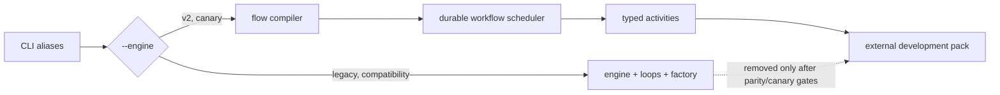
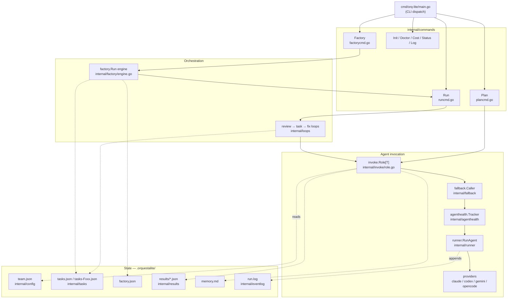
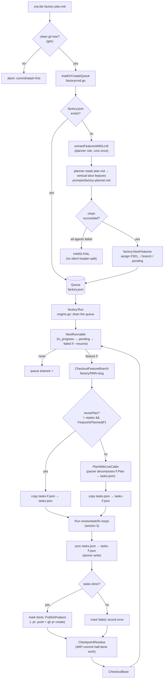
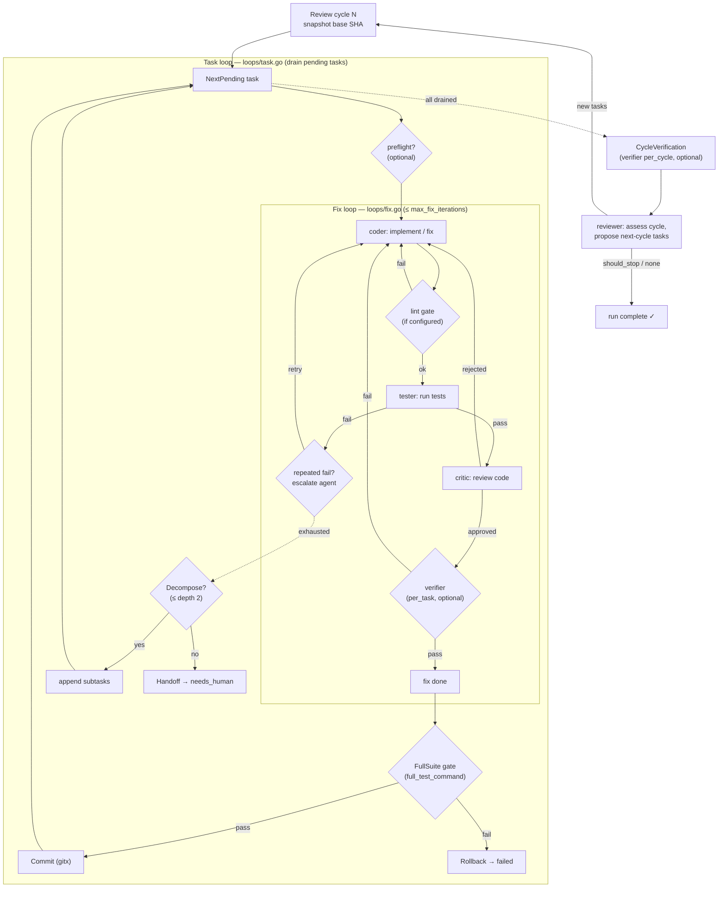
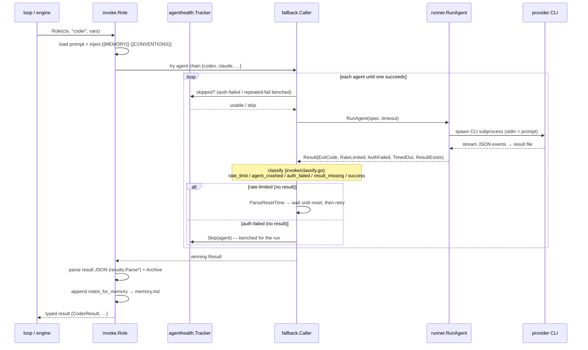

# orq-lite Architecture & Flow

> **Runtime transition (ADR-0005):** the loops/factory architecture documented
> below remains the production compatibility path while the durable dynamic
> workflow runtime is implemented. New orchestration capabilities belong in
> `internal/flow`, `internal/activity`, and `internal/workflow`; the legacy
> engine and specialized schedulers are frozen except for critical fixes. See
> `docs/adr/0005-durable-dynamic-workflow-runtime.md`.

The v2 operational source of truth is `.orquestalite/workflows.db`; its
transactional outbox publishes stable events into `run.log`.
`.orquestalite/orq.db` remains only a rebuildable query projection. A resumed
run uses its stored IR, policy, schemas, activity contracts, and pack digest.
`orq-lite cutover check` is the executable boundary between coexistence and
deletion; its evidence and canary procedure are defined in
`docs/runtime-cutover.md`.

This document explains how `orq-lite` turns a plan into shipped, gate-passed
code, and what every component does. It reflects the architecture including the
**vertical-slice planner** and **per-feature plan reuse**.

> Diagrams are [Mermaid](https://mermaid.js.org/) and render natively on GitHub.

---

## 1. The big picture

`orq-lite` is a layered orchestrator. The CLI dispatches to a **command**, which
drives **loops**, which **invoke roles** (parser, coder, …). Each role call is
resolved to a concrete **agent** (a Claude/Codex CLI subprocess) through a
resilience layer (fallback chain → health tracking → rate-limit waiting). All
state lives under `.orquestalite/`.

---

## 2. Factory mode: plan → vertical slices → shipped branches

`orq-lite factory plan.md` develops an entire backlog. It first **plans
vertical slices**, then runs each as its own feature on its own git branch.

**Why this shape:**

- **The planner (`planner` role) replaces naive `## ` splitting.** Previously
  `ParseFeatures` turned every markdown heading into a "feature", so a plan
  written as `## 1. Goal … ## 11. Verification` produced eleven pseudo-features,
  including non-implementable sections. The planner extracts **independently
  shippable vertical slices** (schema → API → UI → test) and discards
  documentation sections. `ParseFeatures` remains as the offline/test baseline.
- **Reuse is the default.** Each feature persists its decomposition in
  `tasks-Fxxx.json`. A retried or resumed feature continues that list (skipping
  completed tasks) instead of re-planning. `--replan` forces a fresh
  decomposition; `--resume` only makes `failed` features runnable again.
- **Hard-fail over silent fallback.** If the planner's whole agent chain fails,
  the factory aborts with a clear message rather than reverting to the naive
  split that caused the original problem.

---

## 3. The run loop: review ⊃ task ⊃ fix

Within a single feature (or a plain `orq-lite run`), three nested loops drive a
task list to completion. Outer to inner: **review cycles** → **task loop** →
**fix loop**.

**Roles and what each produces** (`internal/results` types):

| Role | Question it answers | Output |
| --- | --- | --- |
| `parser` | What atomic tasks does this feature decompose into? | `ParserResult.Tasks` → `tasks.json` |
| `coder` | Implement / fix the current task. | `CoderResult` (status, files changed) |
| `tester` | Do the relevant tests pass? | `TesterResult` (status, failures) |
| `critic` | Is the code sound? | `CriticResult` (approved/rejected + concerns) |
| `verifier` | Does the running software actually work (black-box)? | `VerifierResult` (checks) |
| `reviewer` | Is the increment good; what's next? | `ReviewerResult` (new tasks, should_stop) |

**Gates that prevent "tests pass but it's broken":**

- **Lint gate** (`lint_command`) runs before the tester; violations feed back to
  the coder in-loop.
- **Full-suite gate** (`full_test_command`, auto-detected when empty) runs after
  the fix loop and before the commit; a failure rolls the task back.
- **Tester-command verification** (`verify_tester_command`) re-runs the tester's
  own command in the orchestrator, so a tester falsely claiming "pass" is caught.
- **Verifier** exercises the software like a human (start app, hit endpoints).

---

## 4. How a role call survives flaky agents

Every role call goes through `invoke.Role`, which is the single choke point for
prompt assembly, agent selection, resilience, result parsing, and memory.

**The resilience rules (learned from real runs):**

- **Fallback chain.** Each role lists agents in order; the next is tried when the
  current one fails recoverably.
- **Classification is result-gated** (`invoke/classify.go`). `rate_limit` and
  `auth_failed` only fire when the agent wrote **no** result file — so a 401 body
  or the words "usage limit" inside code the agent edited never bench a healthy
  agent.
- **Rate-limit waiting** (`fallback` + `reset.go`). When every agent is
  rate-limited, the caller parses the reset time ("resets 7pm", "try again in
  30s") and **waits**, retrying until one frees up, instead of failing the run. A
  just-passed reset falls back to short exponential backoff (never a ~24h wait).
- **Health benching** (`agenthealth.Tracker`). An `auth_failed` agent is skipped
  immediately; a repeatedly-failing one is benched after a threshold — so a dead
  agent (e.g. a CLI whose credential tier was discontinued) isn't retried every
  cycle.

---

## 5. Component reference

| Path | Responsibility |
| --- | --- |
| `cmd/orq-lite/main.go` | CLI entrypoint; flag parsing; subcommand dispatch; optional dashboard. |
| `internal/commands/factorycmd.go` | Factory: build/resume the queue, per-feature branch + plan persistence, publish PRs. |
| `internal/commands/runcmd.go` | Wire live deps (agents, logger, health, fallback) and run the loops over `tasks.json`. |
| `internal/commands/plancmd.go` | Run the parser over a plan and write `tasks.json`. |
| `internal/commands/testdetect.go` | Auto-detect the test/lint command when `team.json` leaves it empty. |
| `internal/commands/initcmd.go` | Scaffold `team.json`, prompts, schemas; language-aware test command. |
| `internal/factory/factory.go` | `Queue`/`Feature` model, `ParseFeatures`/`NewFeatures`, `PlannedFeatures`, `TasksFilePath`, persistence. |
| `internal/factory/engine.go` | `Run`: drain the queue, per-feature lifecycle, reuse-vs-replan decision, budget, residue checkpoint. |
| `internal/loops/review.go` | Review loop: drain tasks, verify increment, run reviewer, queue next-cycle tasks. |
| `internal/loops/task.go` | Task loop: per task → fix loop → full-suite gate → commit/rollback; decompose/handoff on exhaustion. |
| `internal/loops/fix.go` | Fix loop: coder → lint → tester → critic → verifier with retries and agent escalation. |
| `internal/invoke/role.go` | `Role[T]`: prompt assembly, agent invocation, archive, memory; `recordHealth`. |
| `internal/invoke/classify.go` | Map a runner `Result` to a fallback reason (result-gated). |
| `internal/fallback/` | `Caller`: agent chain, cooldowns, exponential backoff, rate-limit waiting (`reset.go`). |
| `internal/agenthealth/` | `Tracker`: bench agents that auth-fail or repeatedly fail. |
| `internal/runner/runner.go` | `RunAgent`: spawn the CLI subprocess, capture output, detect rate-limit/auth/timeout. |
| `internal/providers/` | Per-CLI adapters (`claude`, `codex`, `gemini`, `opencode`): build args, parse the stream-JSON. |
| `internal/config/config.go` | `team.json` model (agents, roles, limits, backoff) + validation/resolution. |
| `internal/results/results.go` | Typed role result structs, parsers, immutable per-run archive. |
| `internal/tasks/tasks.go` | `TaskList`/`Task` model, statuses, load/save. |
| `internal/memory/` | Append/read `memory.md` (cross-cycle `notes_for_memory`). |
| `internal/eventlog/` | Structured `run.log` event stream. |
| `internal/cost/` | Price agent sessions from `run.log` via `agtop`; per-task/per-feature spend. |
| `internal/preflight/` | Optional lightweight task-validity check before the fix loop. |
| `internal/handoff/` | Write a human-readable handoff file when a task can't be automated. |
| `internal/gitx/` | Git operations (branch, commit, rollback, clean-tree checks). |
| `internal/web/` | Live dashboard served from `.orquestalite/` state. |

---

## 6. State on disk (`.orquestalite/`)

| File | Written by | Purpose |
| --- | --- | --- |
| `factory.json` | `factory.Save` | Queue: features, statuses, `PlannedFeatures`, base branch. |
| `tasks.json` | `tasks.Save` | The **active** task list (scratch copy of the running feature). |
| `tasks-Fxxx.json` | `factorycmd` | Each feature's **persisted** decomposition (the reuse source). |
| `results/<role>.json` | agents | Latest result per role (consumed by `results.Parse*`). |
| `results/by-task/…` | `results.Archive` | Immutable per-run archive of every role result. |
| `memory.md` | `internal/memory` | Cross-cycle notes injected as `{{MEMORY}}`. |
| `run.log` | `internal/eventlog` | Every `agent_run`, gate, wait, and transition (used by `cost`, `log`, dashboard). |
| `archive/` | `factorycmd` | Superseded task lists kept for debugging. |

---

## 7. Configuration surface (`team.json`)

- **`agents`** — each CLI agent: `provider` (`claude`/`codex`/`gemini`/`opencode`),
  `model`, `effort`, `rate_limit_pattern`. opencode models use the
  `provider/model` form (e.g. `anthropic/claude-sonnet-4-6`).
- **`roles`** — `planner` (factory only), `parser`, `coder`, `tester`,
  `critic`, `verifier` (optional), `reviewer`. Each declares an ordered `agents`
  chain, a `prompt`, a `result_path`, and a `timeout_seconds`.
- **`limits`** — `max_review_cycles`, `max_fix_iterations`,
  `verify_tester_command`, `factory_budget_usd`, `preflight_enabled`.
- **`rate_limit_backoff`** — `initial_seconds`, `factor`, `max_seconds`,
  `default_pattern`.
- **`full_test_command` / `lint_command`** — the quality gates (auto-detected
  when empty). **`conventions_file`** — house-style doc injected as
  `{{CONVENTIONS}}`.
