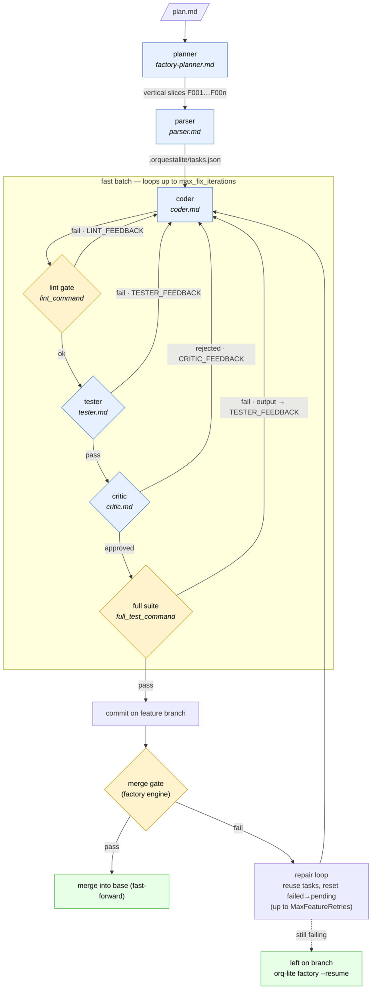

# Fast mode — flow & agent prompts

This document explains how **fast mode** runs a feature end to end, and which
prompt each agent uses at every step. It reflects the code in
`internal/commands/runcmd.go` (`RunFastBatch`), `internal/commands/factorycmd.go`
(`RunFeature` / `RunFeatureFast`), and `internal/factory/engine.go`.

## What fast mode is

The normal (per-task) loop runs the coder → tester → critic cycle **once per
task**, then a reviewer decides on follow-up cycles. Fast mode raises the
orchestration from task level to **feature level**: the whole parsed task list is
treated as a single checklist and the coder/tester/critic pipeline runs **once
over the entire feature**, with a deterministic merge gate at the end.

It is enabled by either:

- `orq-lite factory --fast …` / `orq-lite run --fast` (the `--fast` flag), or
- `limits.fast_mode: true` in `team.json`.

In **factory** mode, every vertical-slice feature (F001, F002, …) is run through
fast mode on its own branch and merged only if it passes the gate.

## The pipeline at a glance



The same flow as plain text (fallback, with prompt/command annotations):

```
orq-lite factory --fast <plan.md>
│
├─ planner ─────────────► splits the plan into vertical-slice features (F001…F00n)
│                          prompt: prompts/factory-planner.md
│
└─ for each feature Fxxx (own branch factory/00x-…):
   │
   ├─ parser ───────────► decomposes the feature plan into a task checklist
   │                       prompt: prompts/parser.md   → .orquestalite/tasks.json
   │
   ├─ FAST BATCH (RunFastBatch) — loops up to limits.max_fix_iterations:
   │   │
   │   ├─ 1. coder  ─────► implements the whole task checklist as one batch
   │   │                    prompt: prompts/coder.md   (archive role: feature-coder)
   │   │
   │   ├─ 2. lint gate ──► deterministic: runs team.json `lint_command`
   │   │                    fail → feed LINT_FEEDBACK to coder, retry
   │   │
   │   ├─ 3. tester ─────► runs the relevant tests, reports pass/fail
   │   │                    prompt: prompts/tester.md  (archive role: feature-tester)
   │   │                    fail → feed TESTER_FEEDBACK to coder, retry
   │   │
   │   ├─ 4. critic ─────► reviews design/quality; may VETO (rejected)
   │   │                    prompt: prompts/critic.md  (archive role: feature-critic)
   │   │                    rejected → feed CRITIC_FEEDBACK to coder, retry
   │   │
   │   └─ 5. full suite ─► deterministic merge gate: runs `full_test_command`
   │                        fail → feed the failing output to coder, retry
   │
   ├─ commit ───────────► commit the batch on the feature branch
   │
   └─ merge gate (engine):
       pass  → merge feature branch into base (fast-forward), continue
       fail  → bounded repair loop (reuse task list, reset failed→pending,
               re-run the fast batch up to MaxFeatureRetries); if still
               failing, leave on the branch for `orq-lite factory --resume`
```

A feature that uses a browser/UI slice (`Visual`) also runs a **visual verify**
pass after close — see [Visual verification](#visual-verification-ui-features).

## Stage-by-stage detail

### 0. Planner — split the plan into features

- **Prompt:** `prompts/factory-planner.md`
- **Role:** `planner` · **Code:** `extractFeaturesWithLLM` (`factorycmd.go`)
- **Input:** the raw plan file (e.g. `docs/backend-api-features.md`).
- **Output:** an ordered list of **vertical slices** — each independently
  testable and shippable — that become features F001…F00n, one branch each.
- The planner explicitly discards documentation-only sections; it emits one
  observable outcome per slice (no conjunctions in the title).

### 1. Parser — decompose a feature into tasks

- **Prompt:** `prompts/parser.md`
- **Role:** `parser` · **Code:** `Plan` / `PlanWithLiveCaller` (`plancmd.go`)
- **Template vars:** `{{MEMORY}}`, `{{PLAN}}`, `{{SKILLS}}`.
- **Output:** `.orquestalite/tasks.json` (also archived as
  `tasks-Fxxx.json`), an atomic, testable task list. Logged as
  `plan_written tasks=N`.
- On a repair retry / `--resume`, the existing `tasks-Fxxx.json` is reused
  (planning is skipped) and any failed tasks are reset to pending so the
  feature can recover.

### 2. The fast batch (`RunFastBatch`)

The batch builds one **feature-scope description** (`fastBatchDescription`):
the feature plan followed by the full task checklist ("implement all of the
following as one coherent batch; use this list as the acceptance checklist").
This single description is what the coder/tester/critic all see as
`{{TASK_DESCRIPTION}}`, with `TASK_ID = _feature` and
`TASK_TITLE = "Feature Fxxx: <title>"`.

The batch loops up to `limits.max_fix_iterations`. Each gate, on failure, sets
the relevant feedback variable, clears the others, and re-runs the coder.

#### 2a. Coder

- **Prompt:** `prompts/coder.md` · **Archive role:** `feature-coder`
- **Template vars consumed:** `{{TASK_ID}}`, `{{TASK_TITLE}}`,
  `{{TASK_DESCRIPTION}}`, `{{ATTEMPT_NUMBER}}`, `{{TESTER_FEEDBACK}}`,
  `{{CRITIC_FEEDBACK}}`, `{{VERIFIER_FEEDBACK}}`, `{{LINT_FEEDBACK}}`,
  `{{PREVIOUS_ATTEMPT_SUMMARY}}`, `{{FILES_CHANGED_SO_FAR}}`, plus
  `{{CONVENTIONS}}`, `{{MEMORY}}`, `{{SKILLS}}`.
- Implements the whole checklist (tests + code), TDD-first, matching the
  surrounding codebase style. If it returns `blocked`, the batch fails with
  `ReasonFeatureFastFailed`.
- **Feedback contract:** every gate below routes its failure into one of the
  feedback placeholders above. A variable passed by the orchestrator but **not**
  referenced in `coder.md` is silently dropped by `prompts.Interpolate` — which
  is exactly the class of bug fixed in v0.1.24 (`LINT_FEEDBACK`).

#### 2b. Lint gate (deterministic)

- **Command:** `team.json` `lint_command` (e.g. `ruff check .`) · **Code:**
  `lintGateOutcome`.
- Not an agent — a deterministic gate run inside the loop. A missing/unspawnable
  linter is **skipped** (never blocks); a real violation returns the linter
  output as `LINT_FEEDBACK` and re-runs the coder.
- Event: `feature_fast_lint_failed`; terminal reason `ReasonFeatureLintFailed`.

#### 2c. Tester

- **Prompt:** `prompts/tester.md` · **Archive role:** `feature-tester`
- **Template vars:** `{{MEMORY}}`, `{{TASK_TITLE}}`, `{{TASK_DESCRIPTION}}`,
  `{{FILES_CHANGED}}`, `{{ATTEMPT_NUMBER}}`.
- Runs the relevant tests and reports `pass`/`fail` (it must not modify source).
- **Tester verification:** when `limits.verify_tester_command` is on, a reported
  `pass` is double-checked by actually re-running the tester's `command_run`; if
  that fails, the pass is overridden to a fail (`tester_verification_failed`).
- Fail → `TESTER_FEEDBACK` to coder, retry. Event:
  `feature_fast_tester_failed`; terminal reason `ReasonFeatureTestsFailed`.

#### 2d. Critic

- **Prompt:** `prompts/critic.md` · **Archive role:** `feature-critic`
- **Template vars:** `{{TASK_TITLE}}`, `{{TASK_DESCRIPTION}}`,
  `{{FILES_CHANGED}}`, `{{ATTEMPT_NUMBER}}`.
- Reviews on two axes (spec vs. standards), may **VETO** with `rejected`. It
  cannot create tasks — out-of-scope concerns go to memory.
- Rejected → `CRITIC_FEEDBACK` to coder, retry. Event:
  `feature_fast_critic_rejected`; terminal reason `ReasonFeatureCriticRejected`.

#### 2e. Full-suite merge gate (deterministic)

- **Command:** `team.json` `full_test_command` (e.g. `uv run pytest -q`) ·
  **Code:** `FullSuite`.
- The authoritative merge gate: it runs the **whole** project test suite, which
  may include tests the per-feature tester scoped out (markers, subsets). An
  empty pytest collection (exit 5) is treated as a pass (`full_suite_empty`).
- On failure it returns a `loops.FullSuiteError` carrying the failing-test
  output; the loop feeds that output to the coder and retries in-loop (added in
  v0.1.25 — before that the output went only to `run.log` and the loop bailed
  after one attempt). Events: `full_suite_failed`, `feature_fast_full_suite_failed`;
  terminal reason `ReasonFeatureTestsFailed`.

#### 2f. Commit & done

When all gates pass, the batch is committed on the feature branch
(`feat(Fxxx): <title>`), the tasks are marked done
(`VerifyFeatureCommitOK`), and `feature_fast_done` is logged.

### 3. Final review (only `orq-lite run --fast`)

When the batch is invoked with `FinalReview: true` (the plain `--fast` run path,
**not** the factory path), it closes with a cycle verification + reviewer pass:

- **Verifier prompt:** `prompts/verifier-cycle.md` · **Archive role:**
  `verifier-cycle` — checks the increment works the way a user would experience
  it (does not trust the test suite).
- **Reviewer prompt:** `prompts/reviewer.md` — inspects the cycle diff and
  decides whether to stop or queue follow-up tasks, against the rubric in
  `prompts/_review-rubric.md`.

The **factory** fast path does not set `FinalReview`; its quality bar is the
merge gate plus (for UI features) visual verification.

### Visual verification (UI features)

For a feature flagged `Visual`, after the batch closes the factory runs a
browser-driven check:

- **Prompt:** `prompts/factory-visual-verify.md` · **Archive role:**
  `visual-verify` (runs on the verifier role's agent chain).
- Each failed visual check becomes a pending fix task and the feature re-runs,
  bounded by `limits.max_visual_rounds` (default 2).

## Gate → feedback routing

| Stage        | Type          | Prompt / command            | On failure → coder var | Event                          |
|--------------|---------------|-----------------------------|------------------------|--------------------------------|
| Coder        | agent         | `prompts/coder.md`          | —                      | `agent_run` (role=coder)       |
| Lint         | deterministic | `lint_command`              | `{{LINT_FEEDBACK}}`    | `feature_fast_lint_failed`     |
| Tester       | agent         | `prompts/tester.md`         | `{{TESTER_FEEDBACK}}`  | `feature_fast_tester_failed`   |
| Critic       | agent         | `prompts/critic.md`         | `{{CRITIC_FEEDBACK}}`  | `feature_fast_critic_rejected` |
| Full suite   | deterministic | `full_test_command`         | `{{TESTER_FEEDBACK}}`* | `feature_fast_full_suite_failed` |

\* The full-suite failure is routed through the tester-feedback slot (it is a
test failure), with a message explaining it is the whole-project merge gate.

## Configuration (`team.json`)

| Key                            | Effect on the fast flow                                            |
|--------------------------------|-------------------------------------------------------------------|
| `limits.fast_mode`             | Enable fast mode without the `--fast` flag.                        |
| `limits.max_fix_iterations`    | Max coder retries per feature across all gates.                   |
| `lint_command`                 | The deterministic lint gate (step 2b). Missing → gate skipped.    |
| `full_test_command`            | The deterministic merge-gate suite (step 2e).                     |
| `limits.verify_tester_command` | Re-run the tester's reported command to confirm a `pass`.         |
| `limits.max_visual_rounds`     | Visual-verify feedback rounds for UI features.                    |

> **Tester vs. gate consistency:** the per-feature tester and the
> `full_test_command` should agree on *what* runs. If the tester scopes tests
> (e.g. `pytest -m 'not docker'`) but the gate runs everything, the gate can
> fail on tests the tester never ran. Keep the scoping in project config (e.g.
> pytest `addopts`) so both invocations match.

## Events reference

`feature_fast_start`, `feature_fast_lint_failed`, `feature_fast_tester_failed`,
`feature_fast_critic_rejected`, `full_suite_failed`,
`feature_fast_full_suite_failed`, `full_suite_empty`, `feature_fast_done`,
`feature_fast_failed`, `plan_written`. Feature-level engine messages
(`… did not pass the merge gate`, `repair attempt n/N`, `merged to master`) come
from `internal/factory/engine.go`.
