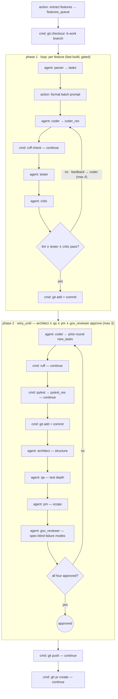

# Example: `fastapi-governed`

A 3-feature FastAPI service built by a **`factory_governed`** flow (bundled here in
[`flows.json`](./flows.json)) that adds a **governance approval loop** on top of the
`factory_fast` style.

## What it builds

`features.md` defines three features:

1. **Health and Application Skeleton** — `create_app()`, `GET /`, `GET /health`.
2. **In-Memory Items CRUD** — Pydantic v2 models, repository/service layers, `POST/GET/GET{id}/DELETE /items`.
3. **Item Search and Pagination** — `q`/`limit`/`offset` query params with `422` validation.

## Flow: `factory_governed`

**Phase 1 — per-feature (fast style), one integration branch:**
`parser → retry_until(coder → ruff → tester → critic)` (max 4 attempts) `→ commit`,
looped over the three features. The retry gate makes the tester/critic verdicts
**binding**: a `fail`/`rejected` routes feedback back to the coder instead of
committing anyway (early versions of this example ran phase 1 linearly, which made
the critic's veto purely advisory — a real footgun).

**Phase 2 — governance loop** (`retry_until {architect_res.pass} && {qa_res.pass} && {pm_res.pass} && {gov_reviewer_res.pass}`, max 3 rounds):
`coder (addresses prior round's tasks) → ruff → pytest → commit → architect → qa → pm → gov_reviewer → eval`.

Each governance role writes `{"status": "approved" | "changes_requested", "new_tasks": [...]}`.
`status:"approved"` maps to a uniform `pass`, so the loop gates on all four. When any
returns `changes_requested`, its `new_tasks` are threaded into the **next round's coder**
via `{architect_res.new_tasks}` etc. (the engine blanks these tokens on round 1). `pytest`
is the deterministic gate, surfaced to architect/QA as `TESTS_PASS` so they can't approve
over a red suite. Four deliberately non-overlapping lenses: architect = structure,
QA = test depth, PM = scope, and **gov_reviewer = spec-blind failure modes** — the
first three validate against the features file, so anything the spec doesn't mention
(partial-update data loss, bulk paths bypassing validation, broken existing
consumers, boundary math) sails through all of them; the adversarial reviewer reads
the raw `git diff` with a hunt list of exactly those failure modes.



## Files

| File | Purpose |
|------|---------|
| `team.json` | Haiku agents; roles `parser, coder, tester, critic, reviewer` (reviewer is required by config but unused by this flow) plus the custom `architect, qa, pm, gov_reviewer`. Test gate `uv run pytest -q`, lint `uv run ruff check .`. |
| `features.md` | The three FastAPI features. |
| `flows.json` | The `factory_governed` flow. |
| `prompts/architect.md`, `qa.md`, `pm.md`, `gov-reviewer.md` | The custom governance role prompts (`gov-reviewer.md` is the adversarial, spec-blind lens). The standard `parser/coder/tester/critic/reviewer` prompts come from the repo's [`prompts/`](../../prompts/). |

> **Custom roles:** `architect`/`qa`/`pm` are not part of the engine's built-in role
> vocabulary — they work because `config.Resolve` surfaces any declared role for
> configuration-driven flows. That is the only code change this example required.

## Prerequisites

- `uv` (`brew install uv` or `curl -LsSf https://astral.sh/uv/install.sh | sh`) — the team
  uses `uv run pytest` / `uv run ruff`
- `claude` CLI authenticated

## Run it

Copy this config next to the repo's `prompts/` (merging the three custom prompts here into
that `prompts/` dir) in a fresh `uv` project with `fastapi`, `pytest`, `httpx`, `ruff`
installed, then:

```sh
orq-lite flow run factory_governed features_path=features.md base_branch=main --log-format verbose
```

### Multi-batch variant: `factory_governed_multi`

Same pipeline with an outer loop over SEVERAL features files ("batches") on one
integration branch — each batch gets its own full governance loop (its own
3-round budget, scoped to its own file via `FEATURES_PATH`), and the run ends
with a single push + PR. Use it to queue dependent batches (batch 2 building on
batch 1's schema) in one unattended run without diluting review depth.

Batches are configured in the flow input's **default** (the CLI passes strings
only, not lists):

```json
"batches": { "default": [
  { "name": "core",   "path": "features.md" },
  { "name": "search", "path": "features-search.md" }
]}
```

```sh
orq-lite flow run factory_governed_multi base_branch=main --log-format verbose
```

Extra caveat: the engine does not reset step outputs between loop iterations,
so round 1 of batch N+1 interpolates batch N's final `*_res.new_tasks` into the
governance coder prompt; the prompt instructs the agent to skip tasks already
addressed on the branch.

## Caveats

- **No conditional/break in the engine:** the governance coder runs once even on round 1
  with empty feedback (a consistency pass).
- **`retry_until` aborts the flow if it never converges** within `max_retries` (3) — the
  intended "don't ship unapproved" behavior, so an unconverged run fails before the PR.
- **Feedback is text, not a durable backlog** — reviewer tasks are threaded into the next
  coder prompt, not persisted to `tasks.json`.
- Approval is ultimately the agents' (haiku) judgment, with `pytest` as the only hard gate.
- **Spec-anchored review has a blind spot** — architect/QA/PM all validate against
  `features.md`, so defects the spec never mentions (an update endpoint resetting
  omitted fields, a bulk path skipping validation, an existing consumer broken by a
  new default, an off-by-one in a date window) can be unanimously approved. That is
  why `gov_reviewer` exists and why its prompt forbids reading the features file as
  anything but context. Field lesson: a real run of this flow shipped exactly those
  four bug classes before the adversarial lens was added.
