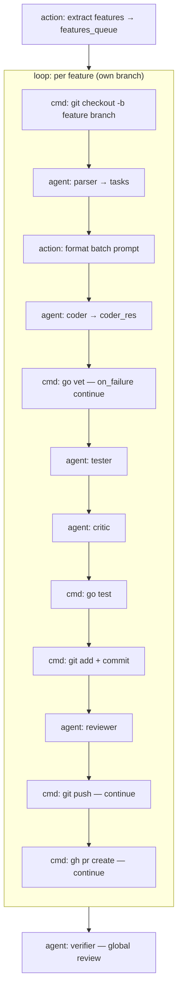

# Example: `go-hello-api`

A minimal Go (standard-library) HTTP API built by the **`factory_fast`** flow, which ships
in the repo's root [`flows.json`](../../flows.json).

## What it builds

One feature (`features.md`): a `GET /hello` endpoint returning `{"message":"hello"}` with a
table-driven `httptest` test, in a module named `demoapi`.

## Flow: `factory_fast`

Per feature, on its own branch: `parser → coder → ruff/vet → tester → critic → go test →
commit → reviewer → push/PR`, then a single global `verifier`. Tasks are batched into one
coder call (no per-task retry) — the "fast" lane.



## Files

| File | Purpose |
|------|---------|
| `team.json` | Haiku agents; roles `parser, coder, tester, critic, reviewer, verifier`. Test gate `go test ./...`, lint gate `go vet ./...`. |
| `features.md` | The single "Hello JSON API" feature. |

## Prerequisites

- `go` on PATH
- `claude` CLI authenticated

## Run it

Copy this config next to the repo's `prompts/` and root `flows.json` in a fresh Go module,
then:

```sh
orq-lite flow run factory_fast features_path=features.md base_branch=main --log-format verbose
```

The repo's `prompts/` directory supplies the `parser/coder/tester/critic/reviewer/verifier`
prompt templates referenced by `team.json`.
