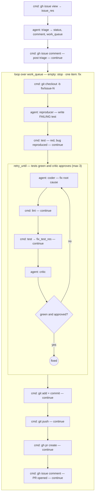

# Example: `issue-fix`

An **`issue_fix`** flow (bundled here in [`flows.json`](./flows.json)) that triages a GitHub
issue and, **only when the evidence is sufficient**, reproduces the bug with a failing test,
fixes it until the suite is green, and opens a PR. Like `pr-review`, it builds no features — it
is keyed by an `issue_number`.

## What it does

```
gh issue view → triage (enough evidence?)
             → gh issue comment (post triage outcome)
             → loop over triage.work_queue:            # 0 items if insufficient, 1 if sufficient
                 git checkout -b fix/issue-N
                 reproducer      → write a FAILING test that captures the bug
                 test            → (red: bug reproduced)
                 retry_until green & critic-approved (max 3):
                     coder       → fix the root cause, keep the reproduction test
                     lint · test → deterministic gates
                     critic      → quality / regression review
                 commit → push → gh pr create → gh issue comment
```

### The branch is data, not an `if`

The engine has **no conditional step**. This flow encodes the "enough evidence?" decision as the
**length of a queue**: `triage` emits `work_queue` as a **one-element array** when the issue is
actionable, or an **empty array** when it isn't. The `loop` over `{triage_res.work_queue}` then
runs the reproduce-and-fix body **once or zero times**. Insufficient issues get only the triage
comment (asking for the missing repro steps / logs / expected behavior) and the flow ends; no
branch, no PR. This "empty-vs-single-element queue as a conditional" is the idiomatic way to
branch in the current engine.

### Reproduce before fix

The `reproducer` writes a failing test *first* and does not touch production code. That red test
is the fix loop's gate: the `coder` is told the test already exists and must make it pass by
fixing the **root cause** without weakening or deleting it, and the `retry_until` only converges
when both the suite (`fix_test_res.pass`) and the `critic` (`critic_res.pass`) agree.



## Flow inputs

| Input | Default | Purpose |
|-------|---------|---------|
| `issue_number` | — (required) | The issue to triage/fix. |
| `base_branch` | `main` | Branch the fix is cut from and PR'd into. |
| `test_command` | `go test ./...` | Reproduction + fix gate — **override for the target stack**. |
| `lint_command` | `go vet ./...` | Lint gate in the fix loop — override likewise. |

## Roles

| Role | Prompt | Used? |
|------|--------|-------|
| `triage` | [`prompts/triage.md`](./prompts/triage.md) | ✅ evidence gate + work queue |
| `reproducer` | [`prompts/reproducer.md`](./prompts/reproducer.md) | ✅ writes the failing test |
| `coder` | repo [`prompts/coder.md`](../../prompts/) | ✅ fixes the root cause |
| `critic` | repo `prompts/critic.md` | ✅ reviews the fix |
| `parser`, `tester`, `reviewer` | repo `prompts/` | ⬜ declared to satisfy `config.Resolve`'s orchestrated role set; unused by this flow |

## Prerequisites

- `gh` CLI authenticated with access to the issue's repo (`gh auth status`)
- `claude` CLI authenticated
- The test/lint commands matching the target project's stack

## Run it

Copy this config next to the repo's `prompts/` in the target repository's working directory, then:

```sh
orq-lite flow run issue_fix issue_number=42 base_branch=main test_command="uv run pytest -q" lint_command="uv run ruff check ." --log-format verbose
```

## Caveats

- **`triage` must always emit `work_queue`** (a one-element array, or `[]`). If it omits the key
  entirely, the `loop` errors with "iterator not found" — the prompt makes this contract
  explicit, but it rests on the model obeying it.
- If the issue is a **feature request or question**, triage marks it insufficient by design —
  this flow only fixes reproducible bugs.
- `retry_until` **aborts the flow** if the fix never goes green within `max_retries` (3); the
  reproduction test and triage comment are still committed/posted, but no PR opens.
- `git push` / `gh pr create` steps are tolerant (`on_failure: continue`), so a run without a
  remote or `gh` write access still reproduces and fixes locally on the `fix/issue-N` branch.
