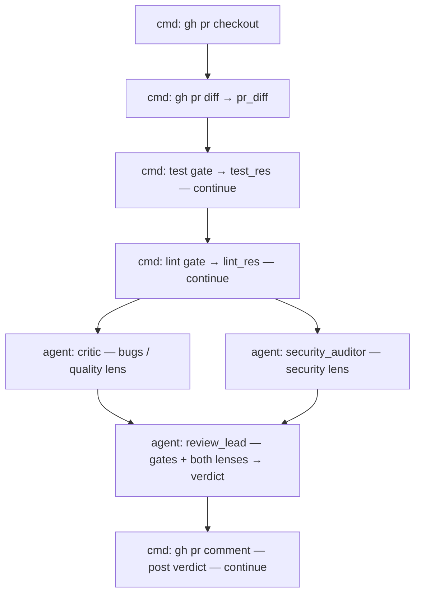

# Example: `pr-review`

A **`pr_review`** flow (bundled here in [`flows.json`](./flows.json)) that reviews an existing
GitHub pull request with independent lenses plus deterministic gates, then synthesizes and posts
a single verdict. Unlike the `factory*` flows, this one **builds nothing** — it is keyed by a
`pr_number`, not a `features.md`.

## What it does

```
gh pr checkout → gh pr diff → tests + lint (gates)
                            → critic  (bugs / quality lens)
                            → security_auditor (security lens)
                            → review_lead (synthesizes gates + both lenses → verdict)
                            → gh pr comment (posts the review)
```

Two agents review the diff along **non-overlapping lenses**, and two **deterministic gates**
(the project's test and lint commands) produce facts, not opinions. The `review_lead` reads all
four signals and resolves them into one verdict (`approve` / `request_changes` / `comment`),
writing the Markdown that gets posted on the PR. A red test suite is never approvable — the
lead is told to treat gate failures as hard blockers.



## Flow inputs

| Input | Default | Purpose |
|-------|---------|---------|
| `pr_number` | — (required) | The PR to review. |
| `base_branch` | `main` | Base for context. |
| `test_command` | `go test ./...` | Deterministic test gate — **override for the target stack** (e.g. `uv run pytest -q`). |
| `lint_command` | `go vet ./...` | Deterministic lint gate — override likewise. |

## Roles

| Role | Prompt | Used? |
|------|--------|-------|
| `critic` | repo [`prompts/critic.md`](../../prompts/) | ✅ bug / quality lens |
| `security_auditor` | [`prompts/security_auditor.md`](./prompts/security_auditor.md) | ✅ security lens |
| `review_lead` | [`prompts/review_lead.md`](./prompts/review_lead.md) | ✅ synthesizer |
| `parser`, `coder`, `tester`, `reviewer` | repo `prompts/` | ⬜ declared because `config.Resolve` requires the orchestrated role set; this flow never invokes them |

## Prerequisites

- `gh` CLI authenticated with access to the PR's repo (`gh auth status`)
- `claude` CLI authenticated
- The test/lint commands matching the target project's stack

## Run it

Copy this config next to the repo's `prompts/` in the target repository's working directory,
then, from a checkout where `gh pr checkout` will work:

```sh
orq-lite flow run pr_review pr_number=123 test_command="uv run pytest -q" lint_command="uv run ruff check ." --log-format verbose
```

## Caveats

- **The engine has no conditional step**, so the flow always posts a *comment* (`gh pr comment`)
  with the verdict in the body, rather than branching to `gh pr review --approve` vs
  `--request-changes`. The `review_lead` result carries a machine-readable `verdict`/`status` if
  you want to gate a follow-up step on it.
- The whole diff is passed into each reviewer's prompt; very large PRs will be truncated by the
  model's context. The reviewers are also checked out on the branch and told to use their own
  file tools for anything the diff doesn't show.
- Approval is ultimately the agents' (haiku) judgment; only tests and lint are hard gates.
