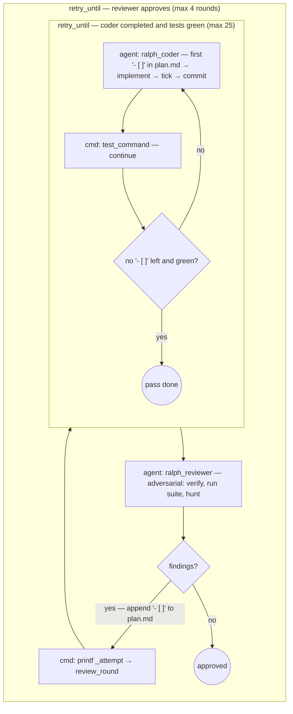

# Example: `ralph-loop`

The simplest **ralph loop** on the flow engine (bundled here in
[`flows.json`](./flows.json)): one coder role is re-invoked with the **same
prompt** and each pass implements the first unchecked `- [ ]` task in
`plan.md`, ticks it, and commits — until no unchecked task remains. Then an
**adversarial reviewer** validates the whole pass and, when it finds defects,
appends them as new `- [ ]` tasks to `plan.md`; the coder loop reruns. The
flow converges when the reviewer approves. No parser, no `tasks.json` —
**`plan.md` checkboxes are the only shared state**.

## What it does

```
retry_until reviewer approves (max 4 rounds):          # meta-loop
    printf {_attempt} → review_round                   # capture the outer round number
    retry_until coder done AND tests green (max 25):   # ralph loop
        ralph_coder   → take FIRST `- [ ]` in plan.md, implement, tick `- [x]`, commit
                        (or fix the failing suite; or mark `- [!]` blocked)
        test_command  → deterministic gate (continue on failure)
    ralph_reviewer    → verify every `- [x]` for real, run the suite, hunt edge cases,
                        adjudicate `- [!]`; findings appended to plan.md as `- [ ]`
```

### The plan file is the state

The engine's `loop` step iterates a **pre-resolved array** and isolates
iterations from each other — it cannot walk a task list that the reviewer
grows mid-run. So this flow uses `retry_until` instead: the coder itself
inspects `plan.md` each pass, and the list can change between rounds. The
`retry_until` step deliberately does **not** isolate attempts, which is what
threads `{coder_res.summary}` and the test-gate output into the next pass.

Checklist grammar (a prompt-level contract, invisible to Go):

| Mark | Meaning |
|------|---------|
| `- [ ]` | pending — the coder takes the first one, top to bottom |
| `- [x]` | done — ticked in the same commit as the implementation |
| `- [!]` | blocked — reason indented under it; the reviewer adjudicates |

### Convergence

- `status: "completed"` from the coder (no `- [ ]` left) sets `pass: true` and,
  together with a green deterministic `test_command` gate, ends the inner loop.
  A coder that claims completion over a red suite gets called again with the
  failures as `{{TEST_OUTPUT}}`.
- `status: "approved"` from the reviewer ends the flow; `changes_requested`
  requires having appended at least one new task. From round 3 the reviewer
  blocks only on critical defects, so a bounded budget converges.
- The nested `retry_until`s share the `{_attempt}` variable, so the outer round
  number is captured first via `printf %s {_attempt}` into
  `{review_round.stdout}` — that's the small trick worth stealing.



## Flow inputs

| Input | Default | Purpose |
|-------|---------|---------|
| `plan_path` | `plan.md` | The checkbox plan — single source of truth. |
| `test_command` | `go test ./...` | Deterministic gate after each coder pass — **override for the target stack**. |

## Roles

| Role | Prompt | Used? |
|------|--------|-------|
| `ralph_coder` | [`prompts/ralph-coder.md`](./prompts/ralph-coder.md) | ✅ one task per pass, same prompt every pass |
| `ralph_reviewer` | [`prompts/ralph-reviewer.md`](./prompts/ralph-reviewer.md) | ✅ adversarial meta-review, writes plan.md |
| `parser`, `coder`, `tester`, `critic`, `reviewer` | repo `prompts/` | ⬜ declared to satisfy `config.Resolve`'s orchestrated role set; unused by this flow |

## Prerequisites

- `claude` CLI authenticated
- A git-initialized target project (the coder and reviewer commit per pass)
- A `test_command` matching the target stack

## Run it

Copy this directory's files into the target repository's working directory
(next to the repo's `prompts/`), seed `plan.md` with your tasks, then:

```sh
orq-lite flow run ralph_loop plan_path=plan.md test_command="uv run pytest -q" --log-format verbose
```

## Caveats

- **The result contracts carry the control flow.** A coder that forgets
  `status: "completed"` when the plan is exhausted burns the remaining inner
  budget; a reviewer that returns `changes_requested` without appending tasks
  loops the coder over an unchanged plan. The prompts make both rules explicit,
  but they rest on the model obeying them.
- **Budgets are hard**: 25 coder passes per round (tasks + fix-ups), 4 review
  rounds. `retry_until` **aborts the flow** when a budget is exhausted — by
  design, unapproved work is never silently shipped. Completed tasks remain
  committed on the branch.
- Everything runs on the **current branch** — cut a work branch first if you
  don't want ralph commits on it.
- The demo `plan.md` targets a Go project; replace its tasks (and
  `test_command`) for your stack.
